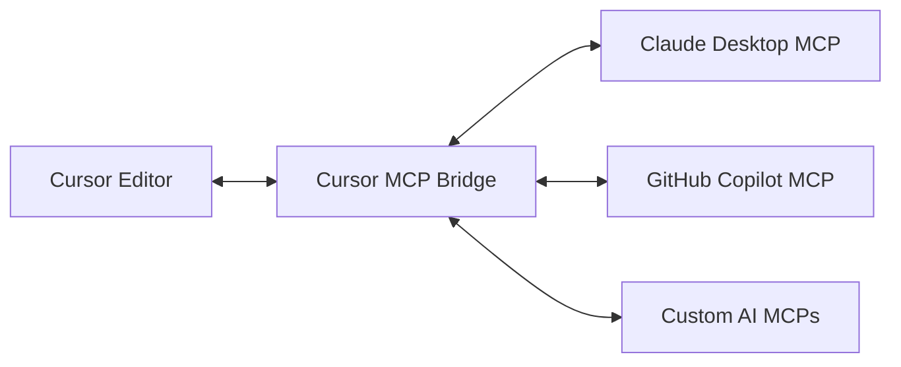

# Cursor MCP (Model Context Protocol)

Cursor MCP is a bridge between Claude's desktop application and the Cursor editor, enabling seamless AI-powered automation and multi-instance management. It's part of the broader Model Context Protocol (MCP) ecosystem, allowing Cursor to interact with various AI models and services through standardized interfaces.

## Overview

### 🤖 AI Integration
- Direct integration with Claude's desktop application
- Ability to leverage other MCP-compatible AI services
- Real-time context sharing between AI and editor
- AI-powered automation and code generation

### 🔌 MCP Protocol Support
- Standardized communication with AI models
- Extensible plugin system for additional MCPs
- Context-aware command execution
- Secure token-based authentication

### 🖥️ Cross-Platform Window Management
- Seamlessly manage Cursor editor windows across operating systems
- Focus, minimize, restore, and arrange windows programmatically
- Track window state changes and positions
- Handle multiple Cursor instances simultaneously

### ⌨️ Input Automation
- AI-driven keyboard input with support for:
  - Code generation and insertion
  - Refactoring operations
  - Context-aware completions
  - Multi-cursor editing
- Intelligent mouse automation including:
  - Smart selection
  - Context-menu operations
  - AI-guided navigation

### 🔄 Process Management
- AI-orchestrated instance management
- Smart workspace organization
- Automatic context preservation
- Intelligent session recovery

## MCP Integration

### Claude Desktop Integration
```typescript
import { ClaudeMCP } from 'cursor-mcp/claude'

// Connect to Claude's desktop app
const claude = await ClaudeMCP.connect()

// Execute AI-powered operations
await claude.generateCode({
    prompt: 'Create a React component',
    context: currentFileContent,
    language: 'typescript'
})

// Get AI suggestions
const suggestions = await claude.getSuggestions({
    code: selectedText,
    type: 'refactor'
})
```

### Using Multiple MCPs
```typescript
import { MCPRegistry } from 'cursor-mcp/registry'

// Register available MCPs
MCPRegistry.register('claude', ClaudeMCP)
MCPRegistry.register('github-copilot', CopilotMCP)

// Use different AI services
const claude = await MCPRegistry.get('claude')
const copilot = await MCPRegistry.get('github-copilot')

// Compare suggestions
const claudeSuggestions = await claude.getSuggestions(context)
const copilotSuggestions = await copilot.getSuggestions(context)
```

### Custom MCP Integration
```typescript
import { BaseMCP, MCPProvider } from 'cursor-mcp/core'

class CustomMCP extends BaseMCP implements MCPProvider {
    async connect() {
        // Custom connection logic
    }

    async generateSuggestions(context: CodeContext) {
        // Custom AI integration
    }
}

// Register custom MCP
MCPRegistry.register('custom-ai', CustomMCP)
```

## Configuration

The tool can be configured through environment variables or a config file at:
- Windows: `%LOCALAPPDATA%\cursor-mcp\config\config.json`
- macOS: `~/Library/Application Support/cursor-mcp/config/config.json`
- Linux: `~/.config/cursor-mcp/config.json`

Example configuration:
```json
{
    "mcp": {
        "claude": {
            "enabled": true,
            "apiKey": "${CLAUDE_API_KEY}",
            "contextWindow": 100000
        },
        "providers": {
            "github-copilot": {
                "enabled": true,
                "auth": "${GITHUB_TOKEN}"
            }
        }
    },
    "autoStart": true,
    "maxInstances": 4,
    "windowArrangement": "grid",
    "logging": {
        "level": "info",
        "file": "cursor-mcp.log"
    }
}
```

## Installation

### Windows
```powershell
# Run as Administrator
Invoke-WebRequest -Uri "https://github.com/your-org/cursor-mcp/releases/latest/download/cursor-mcp-windows.zip" -OutFile "cursor-mcp.zip"
Expand-Archive -Path "cursor-mcp.zip" -DestinationPath "."
.\windows.ps1
```

### macOS
```bash
# Run with sudo
curl -L "https://github.com/your-org/cursor-mcp/releases/latest/download/cursor-mcp-macos.zip" -o "cursor-mcp.zip"
unzip cursor-mcp.zip
sudo ./macos.sh
```

### Linux
```bash
# Run with sudo
curl -L "https://github.com/your-org/cursor-mcp/releases/latest/download/cursor-mcp-linux.zip" -o "cursor-mcp.zip"
unzip cursor-mcp.zip
sudo ./linux.sh
```

## Usage

### Basic Usage
```typescript
import { CursorInstanceManager } from 'cursor-mcp'

// Get the instance manager
const manager = CursorInstanceManager.getInstance()

// Start a new Cursor instance
await manager.startNewInstance()

// Get all running instances
const instances = await manager.getRunningInstances()

// Focus a specific instance
await manager.focusInstance(instances[0])

// Close all instances
await manager.closeAllInstances()
```

### Window Management
```typescript
import { WindowManager } from 'cursor-mcp'

const windowManager = WindowManager.getInstance()

// Find all Cursor windows
const windows = await windowManager.findCursorWindows()

// Focus a window
await windowManager.focusWindow(windows[0])

// Arrange windows side by side
await windowManager.arrangeWindows(windows, 'sideBySide')

// Minimize all windows
for (const window of windows) {
    await windowManager.minimizeWindow(window)
}
```

### Input Automation
```typescript
import { InputAutomationService } from 'cursor-mcp'

const inputService = InputAutomationService.getInstance()

// Type text
await inputService.typeText('Hello, World!')

// Send keyboard shortcuts
if (process.platform === 'darwin') {
    await inputService.sendKeys(['command', 'c'])
} else {
    await inputService.sendKeys(['control', 'c'])
}

// Mouse operations
await inputService.moveMouse(100, 100)
await inputService.mouseClick('left')
await inputService.mouseDrag(100, 100, 200, 200)
```

## How It Works

### Bridge Architecture
This tool acts as a middleware layer between Cursor and MCP servers:
1. **Cursor Integration**:
   - Monitors Cursor's file system events
   - Captures editor state and context
   - Injects responses back into the editor
   - Manages window and process automation

2. **MCP Protocol Translation**:
   - Translates Cursor's internal events into MCP protocol messages
   - Converts MCP responses into Cursor-compatible actions
   - Maintains session state and context
   - Handles authentication and security

3. **Server Communication**:
   - Connects to Claude's desktop app MCP server
   - Routes requests to appropriate AI providers
   - Manages concurrent connections to multiple MCPs
   - Handles fallbacks and error recovery



### Example Workflow

1. **Code Completion Request**:
   ```typescript
   // 1. Cursor Event (File Change)
   // When user types in Cursor:
   function calculateTotal(items) {
     // Calculate the total price of items|  <-- cursor position
   
   // 2. Bridge Translation
   const event = {
     type: 'completion_request',
     context: {
       file: 'shopping-cart.ts',
       line: 2,
       prefix: '// Calculate the total price of items',
       language: 'typescript',
       cursor_position: 43
     }
   }
   
   // 3. MCP Protocol Message
   await mcpServer.call('generate_completion', {
     prompt: event.context,
     max_tokens: 150,
     temperature: 0.7
   })
   
   // 4. Response Translation
   // Bridge converts MCP response:
   const response = `return items.reduce((total, item) => {
     return total + (item.price * item.quantity);
   }, 0);`
   
   // 5. Cursor Integration
   // Bridge injects the code at cursor position
   ```

2. **Code Refactoring**:
   ```typescript
   // 1. Cursor Event (Command)
   // User selects code and triggers refactor command
   const oldCode = `
     if (user.age >= 18) {
       if (user.hasLicense) {
         if (car.isAvailable) {
           rentCar(user, car);
         }
       }
     }
   `
   
   // 2. Bridge Translation
   const event = {
     type: 'refactor_request',
     context: {
       selection: oldCode,
       command: 'simplify_nesting'
     }
   }
   
   // 3. MCP Protocol Message
   await mcpServer.call('refactor_code', {
     code: event.context.selection,
     style: 'simplified',
     maintain_logic: true
   })
   
   // 4. Response Translation
   const response = `
     const canRentCar = user.age >= 18 
       && user.hasLicense 
       && car.isAvailable;
     
     if (canRentCar) {
       rentCar(user, car);
     }
   `
   
   // 5. Cursor Integration
   // Bridge replaces selected code
   ```

3. **Multi-File Context**:
   ```typescript
   // 1. Cursor Event (File Dependencies)
   // When user requests help with a component
   
   // 2. Bridge Translation
   const event = {
     type: 'context_request',
     files: {
       'UserProfile.tsx': '...',
       'types.ts': '...',
       'api.ts': '...'
     },
     focus_file: 'UserProfile.tsx'
   }
   
   // 3. MCP Protocol Message
   await mcpServer.call('analyze_context', {
     files: event.files,
     primary_file: event.focus_file,
     analysis_type: 'component_dependencies'
   })
   
   // 4. Response Processing
   // Bridge maintains context across requests
   ```

### Integration Methods

1. **File System Monitoring**:
   ```typescript
   import { FileSystemWatcher } from 'cursor-mcp/watcher'
   
   const watcher = new FileSystemWatcher({
     paths: ['/path/to/cursor/workspace'],
     events: ['change', 'create', 'delete']
   })
   
   watcher.on('change', async (event) => {
     const mcpMessage = await bridge.translateEvent(event)
     await mcpServer.send(mcpMessage)
   })
   ```

2. **Window Integration**:
   ```typescript
   import { CursorWindow } from 'cursor-mcp/window'
   
   const window = new CursorWindow()
   
   // Inject AI responses
   await window.injectCode({
     position: cursorPosition,
     code: mcpResponse.code,
     animate: true  // Smooth typing animation
   })
   
   // Handle user interactions
   window.onCommand('refactor', async (selection) => {
     const mcpMessage = await bridge.createRefactorRequest(selection)
     const response = await mcpServer.send(mcpMessage)
     await window.applyRefactoring(response)
   })
   ```

3. **Context Management**:
   ```typescript
   import { ContextManager } from 'cursor-mcp/context'
   
   const context = new ContextManager()
   
   // Track file dependencies
   await context.addFile('component.tsx')
   await context.trackDependencies()
   
   // Maintain conversation history
   context.addMessage({
     role: 'user',
     content: 'Refactor this component'
   })
   
   // Send to MCP server
   const response = await mcpServer.send({
     type: 'refactor',
     context: context.getFullContext()
   })
   ```

## Security

- Secure token-based authentication for AI services
- Encrypted communication channels
- Sandboxed execution environment
- Fine-grained permission controls

## Requirements

### Windows
- Windows 10 or later
- Node.js 18 or later
- Administrator privileges for installation

### macOS
- macOS 10.15 (Catalina) or later
- Node.js 18 or later
- Xcode Command Line Tools
- Accessibility permissions for Terminal

### Linux
- X11 display server
- Node.js 18 or later
- xdotool
- libxtst-dev
- libpng++-dev
- build-essential

## Development

### Setup
```bash
# Clone the repository
git clone https://github.com/your-org/cursor-mcp.git
cd cursor-mcp

# Install dependencies
npm install

# Build the project
npm run build

# Run tests
npm test
```

### Running Tests
```bash
# Run all tests
npm test

# Run specific test suite
npm test -- window-management

# Run with coverage
npm run test:coverage
```

## Contributing

We welcome contributions! Please see our [Contributing Guide](CONTRIBUTING.md) for details.

## License

This project is licensed under the MIT License - see the [LICENSE](LICENSE) file for details.

## Support

- 📚 [Documentation](https://your-org.github.io/cursor-mcp)
- 🐛 [Issue Tracker](https://github.com/your-org/cursor-mcp/issues)
- 💬 [Discussions](https://github.com/your-org/cursor-mcp/discussions)
- 🔒 [Security](SECURITY.md)

## Acknowledgments

- [Cursor Editor](https://cursor.sh) - The AI-first code editor
- [Claude AI](https://anthropic.com/claude) - Advanced AI assistant
- [@nut-tree/nut-js](https://github.com/nut-tree/nut-js) - Cross-platform automation
- [active-win](https://github.com/sindresorhus/active-win) - Window detection

